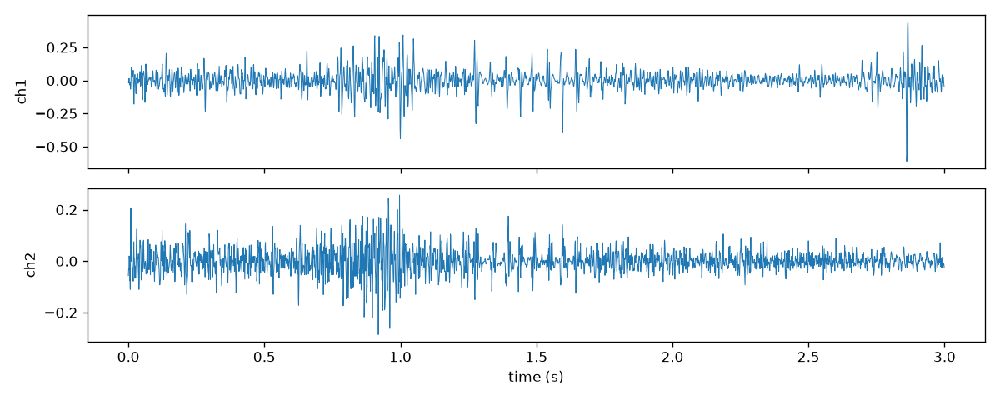
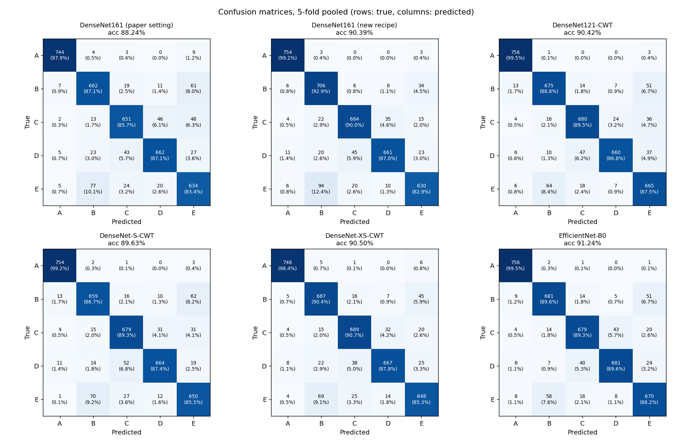
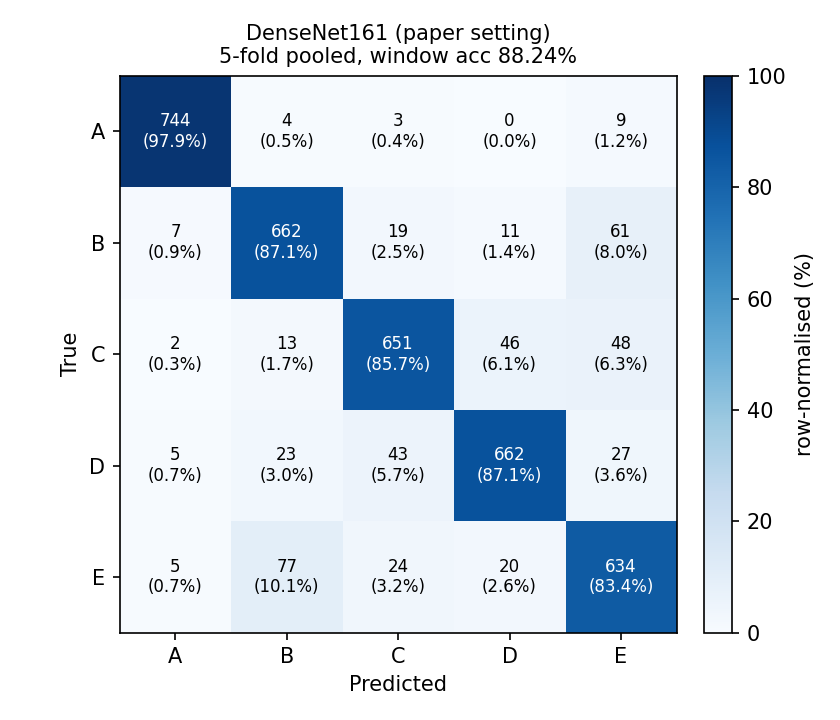
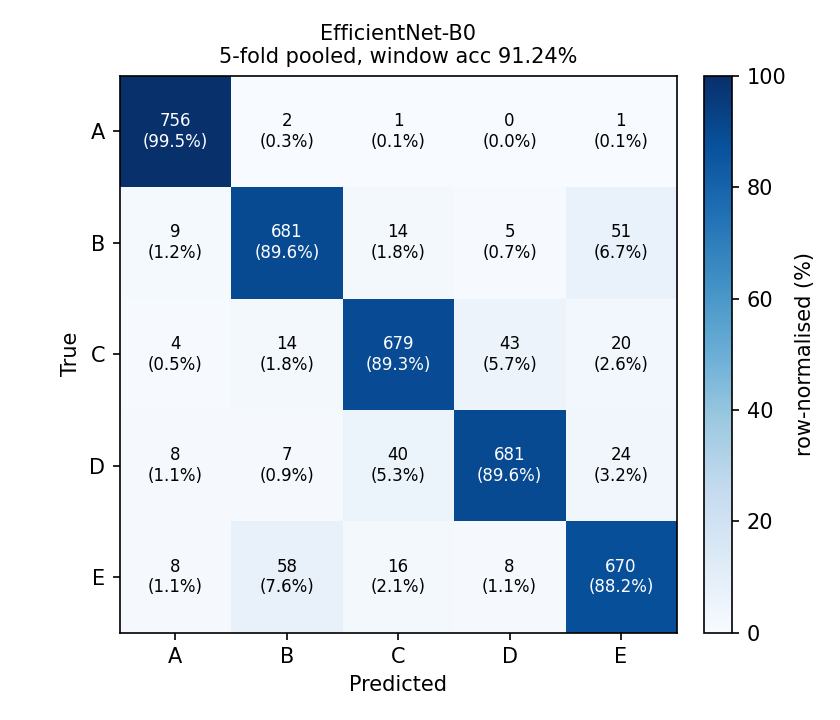
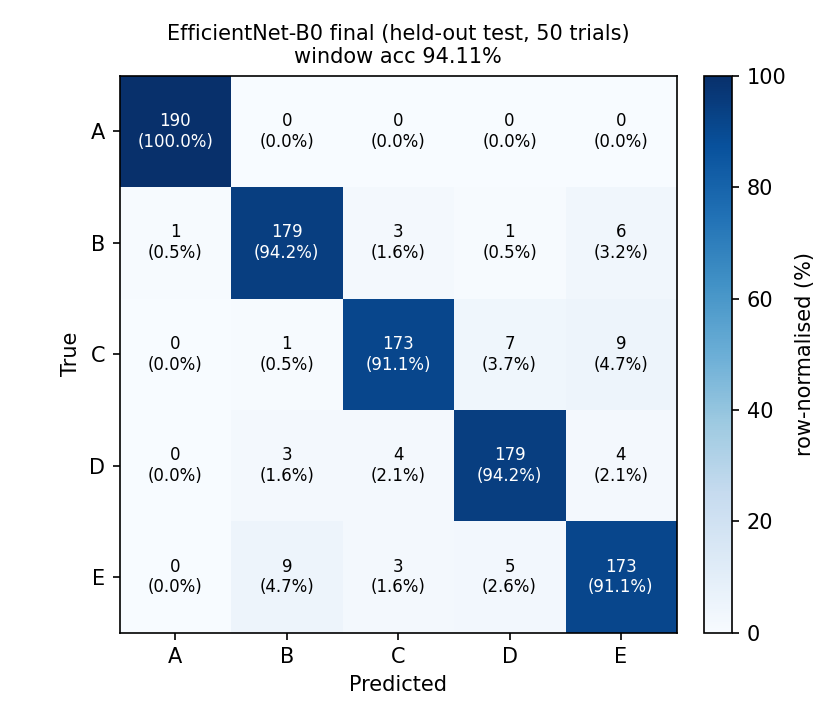

# sEMG 기반 사용자 식별 — AI 모델 재현 및 성능 비교

손바닥 표면근전도(sEMG)로 **도어노브를 돌리는 3초 동작에서 5명 중 누구인지 식별**하는 문제다.
논문이 제안한 **DenseNet161을 논문 설정 그대로 재현**하고, 같은 데이터·같은 분할에서
학습 방법을 바꾼 DenseNet161, CWT 입력에 맞게 줄인 DenseNet 계열 3종, EfficientNet-B0까지
**총 6개 모델을 5-fold 교차검증으로 비교**했다.

- 원 논문: Shin, Y., Kim, J. & Choi, S.-I., *Palm sEMG-based user identification during doorknob rotation using a convolutional neural network*, Scientific Reports **16**, 22244 (2026). [doi:10.1038/s41598-026-46294-3](https://doi.org/10.1038/s41598-026-46294-3)
- 데이터: [sea3551/palm-sEMG-doorknob-filtered](https://github.com/sea3551/palm-sEMG-doorknob-filtered) (CC BY 4.0). 재현이 바로 되도록 `data/`에 사본을 포함했다.

## 결과 한눈에 보기

| 평가 방식 | 모델 | 윈도우 단위 정확도 |
|---|---|---:|
| 5-fold 교차검증 | DenseNet161 (논문 설정, 재현 기준선) | 88.24 ±2.05 % |
| 5-fold 교차검증 | EfficientNet-B0 | **91.24 ±0.93 %** |
| 보류한 test 50개 시행, 1회 평가 | EfficientNet-B0 (최종 모델) | **94.11 %** (연속 3윈도우 98.24 %, 시행 전체 100 %) |

> 위 94.11 %는 논문의 94.00 %를 **같은 조건에서 재현한 값이 아니다.** 최종 모델은 DenseNet161이 아니라
> EfficientNet-B0이고, 논문과 달리 윈도우를 만들기 전에 시행(CSV) 단위로 먼저 분할했다.
> DenseNet161은 test 평가를 하지 않았다. 자세한 내용은 [2장](#논문-수치와의-관계)과 [4장](#4-최종-결과)에 있다.

---

## 1. 코드 설명

### 사용한 데이터 및 전처리 방법

**데이터** — 5명(A~E) × 50시행 = **250시행**. 한 시행은 3초(grasp 1초 → rotate 1초 → stop 1초),
1 kHz, 2채널(채널 1 = APB, 채널 2 = ADM)이고 CSV 한 개(3000 × 2)다. 배포본은 이미
60 Hz notch + 20~500 Hz band-pass 필터링이 되어 있어 추가 필터링을 하지 않았다
(`--refilter` 옵션은 재현용으로만 남겨 두었다).



**분할 — 윈도우를 만들기 전에 시행(CSV) 단위로 먼저 나눈다.** 같은 시행에서 나온, 50 % 겹치는
인접 윈도우가 학습과 검증 양쪽에 들어가는 누수를 막기 위해서다.

| 구분 | 시행 수 | 용도 |
|---|---:|---|
| test | 50 (사람당 10) | 최종 모델을 **한 번만** 평가. 학습·모델 선택에 쓰지 않음 |
| development | 200 (사람당 40) | 5-fold 교차검증. fold당 학습 160 / 검증 40 시행 |

분할(seed 42)은 [`results/splits.json`](results/splits.json)에 저장되어 있고, 모든 모델이 이 분할을 공유한다.
코드로 분할을 새로 만들어도 5개 fold가 모두 같게 재현됨을 확인했다.

**윈도우 → CWT 입력** (`src/data.py`)

1. 슬라이딩 윈도우: 길이 300 샘플(300 ms). 평가는 항상 hop 150(50 % 중첩, 시행당 19개),
   학습은 모델 설정에 따라 hop 150 또는 50(시행당 55개).
2. 윈도우마다 두 채널을 함께 min–max 정규화(0~1).
3. 연속 웨이블릿 변환(Morlet, 스케일 1~32). 채널별 |CWT|와 두 맵의 평균을 3번째 채널로 쌓아
   **(3, 32, 300)** 텐서를 만든다.
4. (새 레시피만) `log1p` 후 0~1 정규화. 스케일축 방향으로 크기 차가 수십 배라서 넣었다.

### 사용한 AI/ML 모델

모두 **무작위 초기화**(사전학습 가중치 없음), 출력 5클래스다.

| 모델 | 구성 | 파라미터 |
|---|---|---:|
| DenseNet161 (논문 설정) | torchvision 표준 DenseNet161. 논문 학습 설정(아래) | 26,483,045 |
| DenseNet161 (새 학습 레시피) | 위와 같은 모델, 학습 방법만 변경 → 구조 효과와 학습법 효과를 분리 | 26,483,045 |
| DenseNet121-CWT | DenseNet121 + CWT용 stem | 6,953,605 |
| DenseNet-S-CWT | growth 24, blocks (6,12,18,12) + CWT용 stem | 2,853,437 |
| DenseNet-XS-CWT | growth 16, blocks (4,8,12,8) + CWT용 stem | 675,945 |
| EfficientNet-B0 | torchvision 표준 구조 | 4,013,953 |

*CWT용 stem*: 표준 stem(7×7 stride 2 + maxpool)은 스케일축(32)을 한 번에 1/4로 줄인다. CWT의 세로축은
주파수 스케일이므로 `Conv(3→C, 커널 (3,7), stride (1,2))` + `MaxPool((2,3), stride (2,2))`로 바꿔
스케일축을 덜 뭉갰다. 논문 설정의 DenseNet161은 이 변경 없이 표준 stem 그대로 두었다. 논문 Table 4의 DenseNet161 파라미터 수(26,483,045)가
torchvision 표준 DenseNet161(5클래스)과 정확히 일치하기 때문이다.

**학습 설정**

| 항목 | 논문 설정 (기준선) | 새 학습 레시피 (나머지 5개 공통) |
|---|---|---|
| epoch / batch | 45 / 16 | 150 / 64 |
| 옵티마이저 | Adam 동등 (AdamW, weight decay 0) | AdamW, lr 6e-4, weight decay 1e-2, warmup 10 + cosine |
| 학습률 | 1e-3 고정 | 6e-4 → 1e-6 |
| 학습 윈도우 hop | 150 (학습 윈도우 3,040개) | 50 (학습 윈도우 8,800개) |
| 증강 | 없음 | 채널 게인, 시간 이동, 가우시안 잡음, SpecAugment, mixup(α 0.2) |
| 정규화 | dropout 0.2 | dropout 0.3 + dense drop 0.1, label smoothing 0.1, weight EMA 0.999 |
| CWT 정규화 | 없음 | `log1p` 후 0~1 |

논문은 dropout을 적용했다는 사실만 밝히고 값은 적지 않아 0.2로 임의 설정했다.
증강은 CWT 텐서 위에서만 하고, 좌우 반전·회전처럼 시간/주파수 축의 의미를 깨는 이미지 증강은 쓰지 않았다.

### 학습 및 테스트 방법

- **5-fold 교차검증**: fold마다 처음부터 학습한다. 매 epoch 검증하여 **검증 손실(순수 cross-entropy)이 가장 낮은 시점**의
  가중치(raw / EMA 중 더 나은 쪽)로 지표를 계산한다.
- **지표**: 윈도우 단위 Accuracy / Precision / Recall / F1 (클래스 macro 평균). fold별로 계산한 뒤
  5-fold 평균 ± 표본표준편차를 낸다. 검증 윈도우는 fold당 760개(클래스당 152개)로 균형이어서
  **macro-Recall은 Accuracy와 항상 같다.**
- **판정 단위를 늘린 지표**(논문이 보고하지 않은 운영 관점 지표): 연속 3개 윈도우(600 ms), 5개(900 ms)의
  확률을 평균해 판정한 정확도, 그리고 시행 전체 19개 윈도우(3초)로 판정한 정확도.
- **최종 test**: 6개 모델 비교는 검증 결과로 한다. 이후 EfficientNet-B0에 대해 하이퍼파라미터 탐색 → ablation →
  seed 재확인을 거쳐 설정을 확정하고, **확정 기록을 먼저 남긴 뒤** development 200시행 전체로 다시 학습하여
  (epoch 120 = fold별 최적 epoch의 중앙값) 보류한 test 50시행을 1회 평가했다. `src/evaluate.py`는 결과 파일이 이미 있으면 실행을 거부한다.

### 실행 방법

실험은 Windows, Python 3.14, PyTorch 2.14.0+cu130, RTX 4060(8 GB)에서 했다.
코드는 CPU에서도 돌아간다. 제출용 폴더는 Linux, Python 3.13, PyTorch 2.14.1+cpu에서
`python main.py eval`과 `python main.py train --smoke`가 동작함을 확인했다.

```bash
pip install -r requirements.txt        # GPU를 쓰려면 PyTorch는 CUDA 빌드(pytorch.org)를 먼저 설치

python main.py report                  # 저장된 결과로 비교표·혼동행렬 다시 만들기 (수 초, GPU 불필요)
python main.py eval                    # 동봉한 최종 체크포인트로 test 50시행 평가 (CPU 약 15초)
python main.py train                   # 6개 모델 5-fold 전체 재실험 (RTX 4060 기준 약 13시간)
python main.py final                   # 최종 모델: 5-fold → 전체 재학습 → test 1회 평가 (약 1.5시간)
python main.py train --dry-run         # 실행할 명령만 출력 (final도 동일)
python main.py train --smoke           # 동작 확인용 1 epoch (수치는 의미 없음)
```

- `main.py`는 `src/`의 스크립트를 README와 같은 인자로 호출할 뿐이다. 학습 산출물(체크포인트 포함)은 `src/runs/`에 쌓이며 git에서 제외된다. 같은 이름의 실행이 이미 끝나 있으면 건너뛴다.
- **`python main.py eval`을 CPU(fp32)로 돌려 확인했을 때는 94.21 %(950개 중 895개)가 나왔다.** 저장된 94.11 %(894개)는 학습 환경(GPU, fp16 자동혼합정밀)에서 나온 값이고,
  CPU에서는 E 윈도우 1개가 C로 분류되던 것이 E로 바뀌었다. 나머지 혼동행렬 칸은 모두 같았다. 이 폴더가 기록하는 공식 test 값은 94.11 %다.
- 처음부터 다시 학습하면 수치가 조금 달라진다. 인자가 완전히 같은 두 실행(`cand_efficientnet_b0`와 `final_base`, seed 42)도 91.24 %와 91.47 %였다.
- `data/`의 CSV는 줄바꿈까지 바이트 그대로여야 한다(`splits.json`이 SHA-256으로 검증한다). 그래서 `.gitattributes`에 `*.csv -text`를 넣었다.

### 코드 설명

| 파일 | 설명 |
|---|---|
| `main.py` | 단일 진입점. `report` / `eval` / `train` / `final` |
| `src/data.py` | 시행 단위 분할(manifest), CSV 로드, 윈도우 → CWT (3, 32, 300) 변환, float16 캐시 |
| `src/models.py` | 모델 10종 생성(CWT stem, 경량 DenseNet 포함), bias·BN을 제외한 weight decay 그룹 |
| `src/augment.py` | CWT 텐서용 증강(채널 게인, 시간 이동, 잡음, SpecAugment)과 mixup |
| `src/engine.py` | 학습 epoch, 평가(윈도우·시행·연속 k·윈도우 위치별 지표), 학습률 스케줄, early stopping |
| `src/train.py` | 5-fold 학습. test 집합은 읽지 않는다 |
| `src/refit.py` | development 전체 재학습 (최종 모델) |
| `src/evaluate.py` | 보류 test 평가. 결과 파일이 있으면 거부 |
| `src/report.py` | `runs/`의 실행들을 콘솔 표로 비교 |
| `src/make_report.py` | `results/`에서 비교표(md/csv), 혼동행렬 PNG, 클래스별 지표를 생성. numpy·matplotlib만 필요 |
| `src/subject_stats.py` | 사람별 원신호 통계 (3장 원인 분석에 사용) |
| `src/autopilot.py`, `src/run_*.ps1` | 하이퍼파라미터 탐색 → ablation → seed 재확인 → test 평가를 무인 실행 (Windows PowerShell 래퍼) |
| `preprocessing_demo/` | 전처리를 단계별로 보여 주는 스크립트: `file.py`(파일·형태 확인) → `sign.py`(파형) → `filter.py`·`filter_check.py`(필터) → `sliding_window.py` → `min_max.py` → `CWT.py`. 저장소 루트에서 실행 |
| `data/` | 데이터셋 사본(CC BY 4.0, 원 저장소 구조 그대로) |
| `checkpoints/efficientnet_b0_final.pt` | 최종 모델 가중치 (16 MB) |
| `results/` | 저장된 결과. 아래 구조 참고 |

```
├── main.py  requirements.txt  .gitignore  .gitattributes
├── src/                       재현 코드
├── preprocessing_demo/        전처리 단계별 시연
├── data/                      데이터셋 (LICENSE, README.md, data/A~E/*.csv)
├── checkpoints/               최종 모델 가중치
├── docs/images/               README용 그림
└── results/
    ├── model_comparison.md/.csv      2장 표 (생성물)
    ├── confusion_summary.md          클래스별 재현율, 상위 오분류 쌍, 대응표본 t 검정
    ├── per_class_metrics.csv         모델·클래스별 precision / recall / F1
    ├── window_position_accuracy.csv  윈도우 위치(0~18)별 정확도
    ├── subject_signal_stats.md       사람별 신호 통계
    ├── final_test.md                 최종 모델 test 결과
    ├── confusion_matrix/             혼동행렬 PNG 8장
    ├── splits.json                   공통 분할
    ├── runs/<실행명>/                config.json, summary.json, fold_*/metrics.json, fold_*/history.csv
    ├── final/                        test_metrics.json, refit_config.json, refit_history.csv
    └── autopilot/REPORT.md           탐색·ablation·seed·test 전체 기록
```

---

## 2. 모델 성능 비교

5-fold 교차검증 결과다(검증 윈도우 760개 × 5 fold = 3,800개). 평균 ± 표본표준편차(%). 생성: `python main.py report` → [`results/model_comparison.md`](results/model_comparison.md)

| Model | Accuracy | Precision | Recall | F1-score |
|---|---|---|---|---|
| DenseNet161 (논문 설정) | 88.24 ±2.05 | 88.51 ±1.92 | 88.24 ±2.05 | 88.23 ±2.04 |
| DenseNet161 (새 학습 레시피) | 90.39 ±1.52 | 90.62 ±1.50 | 90.39 ±1.52 | 90.36 ±1.54 |
| DenseNet121-CWT | 90.42 ±1.51 | 90.66 ±1.38 | 90.42 ±1.51 | 90.42 ±1.49 |
| DenseNet-S-CWT | 89.63 ±1.04 | 89.81 ±1.18 | 89.63 ±1.04 | 89.61 ±1.02 |
| DenseNet-XS-CWT | 90.50 ±1.32 | 90.64 ±1.16 | 90.50 ±1.32 | 90.48 ±1.31 |
| **EfficientNet-B0** | **91.24 ±0.93** | **91.26 ±0.93** | **91.24 ±0.93** | **91.21 ±0.93** |

판정 단위를 늘리면 어떻게 달라지는가:

| Model | 파라미터 | 윈도우 1개 (300 ms) | 연속 3개 (600 ms) | 연속 5개 (900 ms) | 시행 전체 (3 s) | 학습 시간 (5-fold 합) |
|---|---:|---:|---:|---:|---:|---:|
| DenseNet161 (논문 설정) | 26,483,045 | 88.24 | 94.00 | 97.10 | 100 % | 0.95 h |
| DenseNet161 (새 학습 레시피) | 26,483,045 | 90.39 | 94.50 | 97.17 | 100 % | 4.28 h |
| DenseNet121-CWT | 6,953,605 | 90.42 | 95.82 | 97.93 | 100 % | 2.93 h |
| DenseNet-S-CWT | 2,853,437 | 89.63 | 95.09 | 97.53 | 100 % | 2.36 h |
| DenseNet-XS-CWT | 675,945 | 90.50 | 95.74 | 98.00 | 100 % | 1.26 h |
| **EfficientNet-B0** | 4,013,953 | 91.24 | 95.56 | 97.80 | 100 % | 1.21 h |

### 성능 분석

**EfficientNet-B0가 가장 높은 정확도·F1-score(91.21 %)를 보였고 fold 간 편차도 가장 작았다(±0.93).**
논문 설정 DenseNet161보다 +3.00%p 높았고 5개 fold 모두에서 앞섰다. 파라미터는 DenseNet161의 15.2 %(4.0 M)이며,
같은 학습 레시피로 돌린 DenseNet161보다 학습 시간이 3.5배 짧았다(1.21 h vs 4.28 h).
5개 클래스의 재현율이 88.2~99.5 %에 고르게 분포해 특정 사람에게 치우치지 않았다(3장).

**가장 낮은 것은 논문 설정 DenseNet161(88.23 %)이다.** 검증 손실이 가장 낮은 epoch이 fold마다 10, 16, 13, 10, 29로
45 epoch 중 앞쪽에 몰려 있고, 마지막 epoch의 검증 정확도(86.53 %)는 검증 손실 최저 시점 체크포인트의 정확도(88.24 %)보다 낮다. 학습 윈도우 3,040개로
파라미터 26.5 M을 학습하면서 일찍 과적합된 것으로 보인다.

그 밖에 확인한 것:

1. **이득의 대부분은 구조가 아니라 학습 방법에서 나왔다.** 같은 DenseNet161을 새 레시피로만 학습해도 88.24 → 90.39 %(+2.16%p)다.
   EfficientNet-B0의 총 +3.00%p 중 구조 몫은 +0.84%p다. 이후 ablation(부록)에서 학습 윈도우 hop 150 → 50(학습 데이터 약 2.9배)을 되돌릴 때
   macro-F1이 가장 크게 떨어졌다(−1.21%p).
2. **모델 크기는 정확도를 예측하지 못했다.** 새 레시피 5개 모델에서 log10(파라미터)와 정확도의 상관계수는 +0.02다.
   파라미터가 39배 적은 DenseNet-XS-CWT(0.68 M, 90.50 %)가 DenseNet161(26.5 M, 90.39 %)과 같은 수준이다.
3. **새 레시피 모델들 사이의 차이는 대부분 통계적으로 구분되지 않는다.** 같은 fold끼리 짝지은 대응표본 t 검정(df = 4, 5 % 임계값 t = 2.776)에서
   EfficientNet-B0은 논문 설정 DenseNet161(t = 4.02)과 새 레시피 DenseNet161(t = 2.90)보다만 유의하게 앞섰고, DenseNet-S-CWT(t = 2.69),
   DenseNet121-CWT(t = 1.25), DenseNet-XS-CWT(t = 1.53)와는 구분되지 않았다. fold가 5개뿐이라 검정력이 낮고, 같은 설정으로 seed만 바꾼 EfficientNet-B0 실행들이
   90.42 ~ 91.50 %로 약 1.1%p 흔들렸다(부록). **1%p 안쪽의 순위 차이는 우열의 근거가 되지 않는다.** (전체 t 표: [`results/confusion_summary.md`](results/confusion_summary.md))
4. **3초 전체를 보고 판정하면 6개 모델 모두 100 %다.** 윈도우 하나(300 ms)만 보는 지표가 낮은 것이지, 사람을 못 가려내는 것이 아니다.

### 논문 수치와의 관계

논문은 DenseNet161의 test 정확도를 94.00 %(5-fold 검증 평균 91.66 ± 2.78 %)로 보고한다. 같은 모델을 논문 설정으로 재현한 이 실험의 5-fold 평균은
**88.24 %**다. 두 값은 직접 비교할 수 없다. 이 실험은 윈도우를 만들기 전에 시행 단위로 분할하지만, 논문 Methods는 필터링·슬라이딩 윈도우·CWT를 설명한 다음에 "entire collected dataset … 8:2"로 분할을 서술하므로 윈도우를 만든 뒤 나눈 것으로 읽힐 여지가 있고,
그 경우 50 % 겹치는 인접 윈도우가 학습과 평가 양쪽에 들어가 점수가 높아질 수 있다. 다만 시행 50개의 20 %와 윈도우 4,750개의 20 %가 둘 다 950개라서
**논문 텍스트만으로는 어느 쪽인지 확정할 수 없다.** 따라서 "논문 수치를 재현하지 못했다"가 아니라 "논문 설정은 누수 없는 평가에서 88.24 %였다"가 이 실험이 말할 수 있는 전부다.

---

## 3. Confusion Matrix 분석

5-fold 검증 결과를 합산한 혼동행렬이다(행 = 정답, 열 = 예측, 클래스당 760개, 칸 안은 개수와 행 기준 비율). Model 1·2는 2장 표의 첫째 줄(DenseNet161 논문 설정)과 마지막 줄(EfficientNet-B0)이고, Model 3은 4장의 최종 모델 test 결과다.
6개 모델 전체: [`results/confusion_matrix/all_models.png`](results/confusion_matrix/all_models.png)



### Model 1: DenseNet161 (논문 설정)



**분석**

- **가장 잘 분류된 클래스**: **A** — 재현율 97.9 %(744/760), 정밀도 97.5 %.
- **가장 많이 오분류된 클래스**: **E** — 재현율 83.4 %(126개 오분류), 정밀도도 81.4 %로 가장 낮다. 그다음은 C(85.7 %).
- **주요 오분류 유형**: ① **E↔B** — E→B 77개, B→E 61개, 합 138개로 전체 오류 447개의 30.9 %. ② **C↔D** — C→D 46개, D→C 43개(합 89개, 19.9 %).
  ③ **C↔E** — C→E 48개, E→C 24개(합 72개, 16.1 %). A가 얽힌 오류는 35개(7.8 %)뿐이다.
- **오분류가 발생한 이유 (추정 포함)**
  - 사람 간 신호 크기가 겹친다. 아래 표에서 B·C·E는 두 채널 RMS 평균이 0.037~0.050으로 서로 가깝고(특히 C 0.049와 E 0.050), B와 E는 APB/ADM 비도 2.74와 2.50으로 비슷하다.
    반면 A는 RMS가 0.146, 비가 7.44로 눈에 띄게 달라서 거의 완벽하게 분류된다. 전처리의 윈도우별 min–max 정규화는 두 채널을 함께 정규화하므로 절대 크기는 지워지고 채널 간 비율만 남는다(`src/data.py`).
    따라서 B·C·E처럼 크기와 비가 비슷한 사람끼리 구별 단서가 가장 적다는 것은 혼동행렬과 일관되지만, 이것을 원인으로 확인하는 실험(예: 진폭 정보를 복원)은 하지 않았다.
  - C↔D는 위 지표로 설명되지 않는다(RMS 0.049 vs 0.075, 비 2.05 vs 1.31로 B·E보다 오히려 멀다). 원인은 규명하지 못했다.
  - 과적합. 학습 정확도가 마지막 epoch에 98.4 %에 이르는데 검증 정확도는 86.5 %로 낮다(2장). 데이터에 비해 모델이 너무 커서 사람 고유의 패턴보다 학습 시행의 세부를 외웠을 가능성이 있다.

### Model 2: EfficientNet-B0



**분석**

- **가장 잘 분류된 클래스**: **A** — 재현율 99.5 %(756/760), 정밀도 96.3 %. (A의 정밀도가 낮은 것은 다른 사람 29개 윈도우가 A로 잘못 들어왔기 때문이다.)
- **가장 많이 오분류된 클래스**: **E** — 재현율 88.2 %(90개 오분류). 나머지 B 89.6 %, C 89.3 %, D 89.6 %로 모두 비슷해서 Model 1(최저 83.4 %)보다 클래스 간 격차가 줄었다(14.5%p → 11.3%p).
- **주요 오분류 유형**: ① **E↔B** — E→B 58개, B→E 51개(합 109개). ② **C↔D** — C→D 43개, D→C 40개(합 83개). 총 오류는 447개 → 333개로 25.5 % 줄었고,
  C↔E(72 → 36개)와 B↔D(34 → 12개)가 크게 줄었지만 E↔B와 C↔D는 그대로 남아 전체 오류의 57.7 %를 차지한다(Model 1은 50.8 %).
- **클래스별 재현율 향상 (Model 1 대비)**: A +1.6, B +2.5, C +3.7, D +2.5, **E +4.7**%p. 한 쌍만 좋아진 것이 아니라 다섯 클래스에 고르게 퍼져 있고, 가장 약했던 E가 가장 많이 올랐다.
- **오분류가 발생한 이유 (추정 포함)**: 남은 오류는 Model 1과 같은 쌍(E↔B, C↔D)에 몰려 있어 모델이 달라져도 사라지지 않는 **사람 간 신호 자체의 유사성**이 주된 한계로 보인다.
  EfficientNet-B0이 더 나은 것은 크기 때문이 아니라 구조(MBConv + squeeze-excitation) 때문일 가능성이 있으나, 이 실험으로는 어느 구성 요소 덕인지 분리할 수 없다.

### Model 3: EfficientNet-B0 최종 모델 (보류 test 50개 시행)

development 200시행 전체로 다시 학습한 최종 모델을 보류한 test 50시행(윈도우 950개, 클래스당 190개)에 **한 번** 적용한 결과다. 위 두 모델은 5-fold 검증, 이것은 별도의 test라서 둘을 직접 이어 비교하지 않는다.



**분석**

- **가장 잘 분류된 클래스**: **A** — 190개 모두 정확(재현율 100 %, 정밀도 99.5 %).
- **가장 많이 오분류된 클래스**: **E**(F1 90.6 %로 최저, 정밀도 90.1 %도 최저). E와 C는 재현율이 91.1 %(173/190)로 같다.
- **주요 오분류 유형**: 오류 56개 중 **B↔E 15개**(E→B 9, B→E 6), **C↔E 12개**(C→E 9, E→C 3), **C↔D 11개**(C→D 7, D→C 4)가 38개(67.9 %)다. 검증에서 본 B↔E, C↔D 쌍이 test에서도 그대로 상위다.
  A가 얽힌 오류는 1개뿐이다.
- **오분류가 발생한 이유**: 5-fold 검증과 같은 쌍에서 같은 유형의 오류가 나온 것은 위의 사람 간 신호 유사성이 특정 fold나 분할의 우연이 아니라는 정황이다. 다만 클래스당 190개 윈도우(시행 10개)라서 칸 하나가 1~2개 바뀌는 것만으로 순위가 달라질 수 있다.
  (CPU fp32로 다시 평가하면 이 혼동행렬에서 E 윈도우 1개가 달라져 94.21 %가 된다. 1장 실행 방법 참고.)
- 시행 전체(3초)로 판정하면 test 50개 시행 모두 정확했다(시행 단위 혼동행렬은 대각선이 전부 10).

### 나머지 모델 요약 (5-fold 합산)

| 모델 | 가장 잘 분류 | 가장 약한 클래스 | 상위 오분류 |
|---|---|---|---|
| DenseNet161 (새 학습 레시피) | A 99.2 % | E 82.9 % | E→B 94, D→C 45, C→D 35, B→E 34 |
| DenseNet121-CWT | A 99.5 % | D 86.8 % | E→B 64, B→E 51, D→C 47, D→E 37 |
| DenseNet-S-CWT | A 99.2 % | E 85.5 % | E→B 70, B→E 62, D→C 52, C→E 31 |
| DenseNet-XS-CWT | A 98.4 % | E 85.3 % | E→B 69, B→E 45, D→C 38, C→D 32 |

6개 모델 모두 **A가 가장 잘 분류되고(97.9~99.5 %), 가장 많이 틀리는 쌍은 E↔B**(DenseNet121-CWT를 제외하면 가장 약한 클래스도 E)다. C↔D의 한 방향(C→D 또는 D→C)은 모든 모델의 상위 4개 안에 든다.

### 오분류 원인 자료

**사람별 원신호 통계** (`python src/subject_stats.py`, 원본 CSV 250개. RMS는 시행별로 구해 평균, 단위는 CSV 값 그대로)

| 사람 | 시행 수 | APB RMS | ADM RMS | 두 채널 RMS 평균 | APB/ADM 비 (시행별 평균) |
|---|---:|---:|---:|---:|---:|
| A | 50 | 0.2579 | 0.0348 | 0.1464 | 7.44 |
| B | 50 | 0.0536 | 0.0197 | 0.0367 | 2.74 |
| C | 50 | 0.0656 | 0.0327 | 0.0491 | 2.05 |
| D | 50 | 0.0835 | 0.0672 | 0.0753 | 1.31 |
| E | 50 | 0.0717 | 0.0289 | 0.0503 | 2.50 |

**윈도우 위치별 정확도** ([`results/window_position_accuracy.csv`](results/window_position_accuracy.csv), 위치 p는 시작 150·p ms의 300 ms 윈도우)

- **시행의 마지막 윈도우(위치 18, 2.7~3.0 s)가 6개 모델 중 5개에서 가장 낮고, EfficientNet-B0에서도 위치 6과 같은 85.5 %로 공동 최저다**: 논문 설정 DenseNet161 77.0 %, DenseNet121-CWT 79.5 %, EfficientNet-B0 85.5 %.
  이 윈도우의 신호 세기는 약하지 않다(250시행 평균 RMS가 직전 위치 17보다 큼). 동작이 끝난 뒤의 구간이고 위 파형 예시에도 끝부분(약 2.87 s)에 큰 스파이크가 있지만, 이것이 원인인지는 확인하지 않았다.
- 신호가 가장 센 위치(위치 6, 0.9~1.2 s, 파지→회전 전환부)도 낮다(논문 설정 84.5 %, EfficientNet-B0 85.5 %). 사람 간 공통적인 폭발적 활성이라 개인 식별 단서가 적을 수 있다(추정).
- 정지 구간(위치 13~18)이 신호가 약해 어려울 것이라는 사전 추정은 틀렸다. 활성 구간(위치 4~8)의 평균은 86.30 %(논문 설정)·88.80 %(EfficientNet-B0)인데 정지 구간 평균은 87.00 %·91.58 %로 오히려 높다.

---

## 4. 최종 결과

- **가장 성능이 좋은 모델**: **EfficientNet-B0** — 5-fold 검증 정확도 91.24 ±0.93 %, F1 91.21 %. 최종 모델(development 전체 재학습)의 보류 test 결과는 아래 표다.
- **가장 성능이 낮은 모델**: **DenseNet161 (논문 설정)** — 88.24 ±2.05 %, F1 88.23 %.
- **주요 오분류 클래스**: 대부분의 모델에서 **E**가 가장 많이 틀리고(5-fold 검증 재현율 83.4~88.2 %, test에서는 C와 같은 91.1 %로 최저), 오류는 **E↔B**와 **C↔D**(검증), **E↔B·C↔E·C↔D**(test) 쌍에 몰린다. A는 모든 모델에서 거의 완벽하다.

**최종 모델 test 결과** (보류한 50개 시행, 950개 윈도우, 1회 평가. [`results/final_test.md`](results/final_test.md))

| 지표 | 값 |
|---|---:|
| Accuracy (윈도우 1개, 300 ms) | 94.11 % |
| Precision (macro) | 94.11 % |
| Recall (macro) | 94.11 % |
| F1-score (macro) | 94.10 % |
| 연속 3개 윈도우 (600 ms) | 98.24 % |
| 연속 5개 윈도우 (900 ms) | 99.87 % |
| 시행 전체 (3 s) | 100.00 % |

### 전체적인 실험 결과 및 느낀 점

1. **정확도를 올린 것은 모델 교체보다 학습 방법이었다.** 같은 DenseNet161이 학습 방법만 바꿔 +2.16%p 올랐고, 구조를 EfficientNet-B0으로 바꾼 몫은 +0.84%p였다.
   모델 크기(0.68 M ~ 26.5 M)는 정확도와 관계가 없었다. 작은 데이터(학습 시행 160개)에서는 모델을 키우기 전에 윈도우 hop 축소 같은 데이터 양 확보와 정규화를 먼저 봐야 한다.
2. **어떤 단위로 판정하느냐에 따라 같은 모델이 88 %에도, 100 %에도 해당한다.** 윈도우 하나(300 ms)로는 88~91 %지만, 3초 동작 전체를 보면 6개 모델 모두 5-fold 검증에서, 최종 모델은 test에서도 틀린 시행이 없었다.
   윈도우 단위 숫자만으로 "94 %냐 88 %냐"를 따지는 것은 도어노브 인증이라는 실제 사용과 거리가 있다.
3. **논문 수치와는 평가 방식이 달라 직접 비교하지 못했다.** 논문 설정 DenseNet161은 시행 단위 분할에서 88.24 %였다. 94.11 %는 다른 모델(EfficientNet-B0)을 다른 분할 방식으로 평가한 값이며, DenseNet161은 test를 평가하지 않았다.
4. **선정 과정에서 알게 된 점.** 하이퍼파라미터 탐색(부록)에서 epoch을 250·400으로 늘려도 좋아지지 않았고(fold 0 정확도 91.32 → 90.39, 90.13), 설정 동결 단계에서는 "증강 끄기"가 검증 macro-F1을 0.37%p 앞서 자동 교체 기준(0.3%p)을 넘어
   최종 설정이 되었다. 이 차이는 seed 변동(약 1.1%p)보다 작으므로 **증강이 해롭다는 증거가 아니라 잡음 안의 선택**이다. test 결과가 94.11 %로 나왔다고 해서 이 선택이 옳았다는 뜻도 아니다.

**한계**

- 사람이 5명이고 단일 세션의 등록 사용자 식별(closed-set)이다. 미등록 사용자 거절(FAR/FRR/EER), 날짜·전극 재부착 변화는 다루지 않았다. 등록 인원이 늘면 순위가 바뀔 수 있다.
- fold 5개, 모델당 seed 1개라서 위 t 검정은 참고용이다. 모델은 검증 성능으로 골랐으므로 검증 수치에는 낙관 편향이 있고, 편향 없는 값은 test뿐이다(단, 모델 하나, test 시행 50개).
- 5-fold 비교 결과와 test는 평가 방식이 달라 한 표에 섞어 쓰지 않았다.

---

## 부록. 추가 실험 요약 (EfficientNet-B0, 전체 기록: [`results/autopilot/REPORT.md`](results/autopilot/REPORT.md))

**하이퍼파라미터 탐색** (fold 0 기준 macro-F1 %, 상위 조합은 fold 1에서 재확인)

| lr \ weight decay | 1e-3 | 1e-2 | 5e-2 |
|---|---:|---:|---:|
| 3e-4 | 90.51 | 91.04 | 91.03 |
| **6e-4** | 89.97 | **91.30** | 90.26 |
| 1e-3 | 90.92 | 90.01 | 90.79 |

lr 6e-4 / weight decay 1e-2가 fold 0(91.30)과 fold 1(91.78)에서 모두 1위였다. batch 32 / 64 / 128은 91.04 / 91.30 / 90.78, epoch 150 / 250 / 400은 91.30 / 90.35 / 90.12 → **batch 64, 150 epoch 유지.**

**Ablation** (확정 설정 5-fold macro-F1 91.46에서 한 가지씩 제거. 양수 = 그 요소가 도움)

| 제거한 것 | macro-F1 | 기여도 |
|---|---:|---:|
| 학습 hop 50 → 150 | 90.25 | +1.21%p |
| mixup | 91.24 | +0.21%p |
| weight EMA | 91.35 | +0.10%p |
| CWT `log1p` 정규화 | 91.58 | −0.12%p |
| 증강 전부 | 91.83 | −0.37%p |

**seed 재확인** (같은 설정, 5-fold 정확도): seed 42 91.47 ±1.67 / seed 123 90.42 ±1.17 / seed 2026 91.50 ±1.17.

---

## 참고

- Shin, Y., Kim, J. & Choi, S.-I. (2026). *Palm sEMG-based user identification during doorknob rotation using a convolutional neural network.* Scientific Reports 16, 22244. https://doi.org/10.1038/s41598-026-46294-3
- Huang, G. et al. *Densely Connected Convolutional Networks.* https://arxiv.org/abs/1608.06993
- Tan, M. & Le, Q. *EfficientNet: Rethinking Model Scaling for CNNs.* https://arxiv.org/abs/1905.11946
- Loshchilov, I. & Hutter, F. *Decoupled Weight Decay Regularization.* https://arxiv.org/abs/1711.05101
- Park, D. S. et al. *SpecAugment.* https://arxiv.org/abs/1904.08779 · Zhang, H. et al. *mixup.* https://arxiv.org/abs/1710.09412
- 데이터: Yeonjung Shin 외, palm-sEMG-doorknob-filtered, CC BY 4.0 (`data/LICENSE`)


#### * README는 소스코드와 실험 결과, 보고서를 토대로 AI가 작성함.
